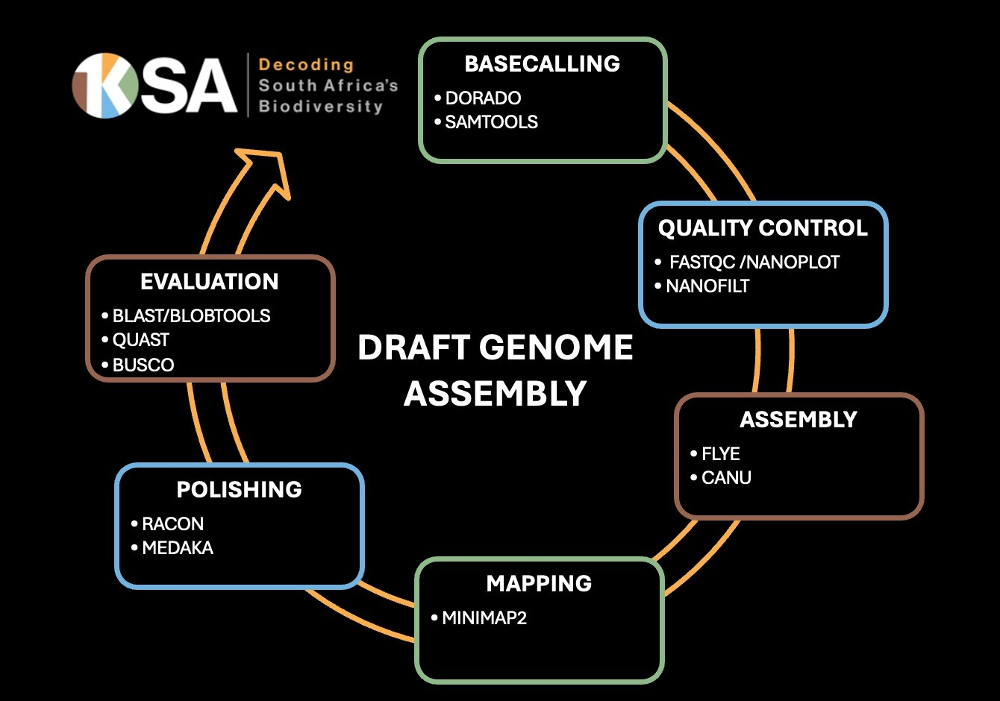

# Genome-Assembly-Pipeline-Nextflow
This repository contains a nextflow pipeline for denovo genome assembly of long ONT reads.
This pipeline was bulit to supprt the genome assembly and anlysis of the 1KSA project - A pilot project aimed at sequencing and assemblying indegenious South African species.

# Introduction

This workflow uses the following:
* Dorado for basecalling
* Samtools for converting bam files to fastq files
* Nanoplot for quality check
* Nanofilt for filtering and trimming
* Flye for genome assembly
* Racon for first round assembly polishing
* Medaka for second round assembly polishing
* BUSCO for assembly quality assessment
* QUAST for assembly quality assessment

Flye is used sepcifically for the assembly of diploid species. It is recommended to use canu (https://github.com/marbl/canu.git) for polyploid species as well as Purge_Dups (https://github.com/dfguan/purge_dups.git).

# Dependencies

The following modules need to be loaded on the CHPC before running the pipeline:
* module purge
* module load chpc/BIOMODULES
* module load dorado
* module load samtools/1.9
* module load nanoplot
* module load nanofilt
* module load flye/2.9
* module load minimap2
* module load racon/1.5.0
* module load medaka/1.11.3
* module load quast/4.6.3
* module load quast/4.6.3
* module load busco/5.4.5
* module load bbmap/38.95
* module load metaeuk
* module load python
* module load nextflow/23.10.0-all

The following models and databases need to be downloaded before running the pipeline:
* Dorado: dorado download --model dna_r10.4.1_e8.2_400bps_hac@v4.2.0
* Busco: busco download eukaryota_odb10.2020-09-10.tar

# Usage

To obtain the workflow, having installed nextflow, users can run:
* nextflow run main.nf --help
to see the options for the workflow.

# Workflow outputs

The primary outputs of the pipeline include:
* A fastq quality control report
* 3 assembled fasta files (From Flye, Racon and Medaka)
* A busco report
* A quast quality report
